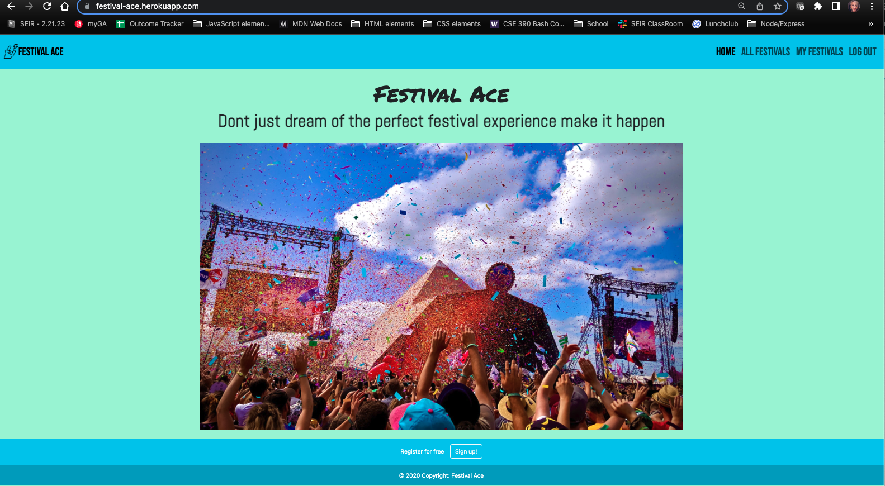
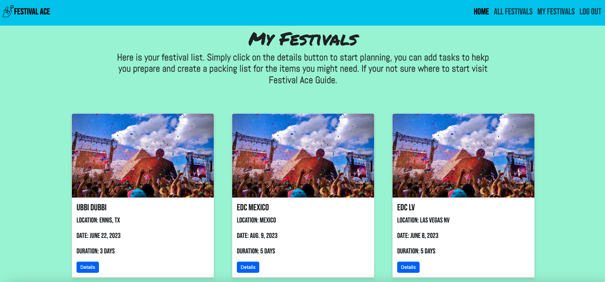
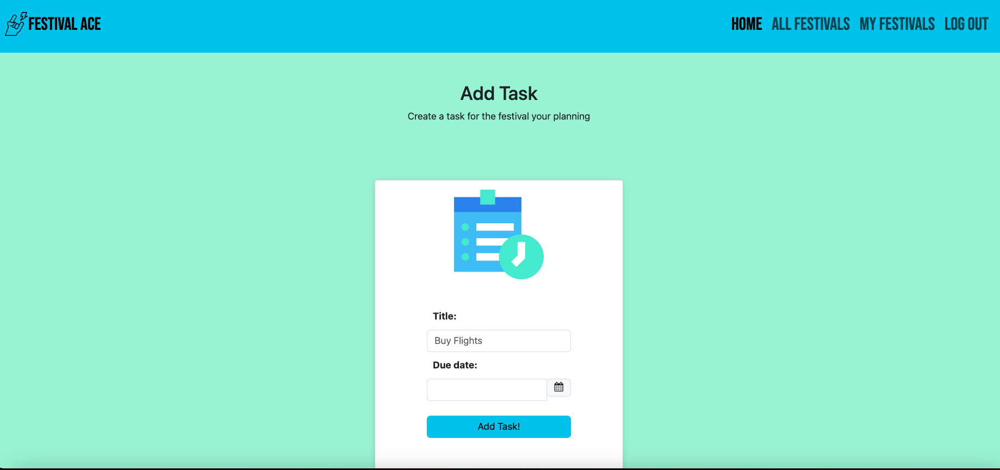
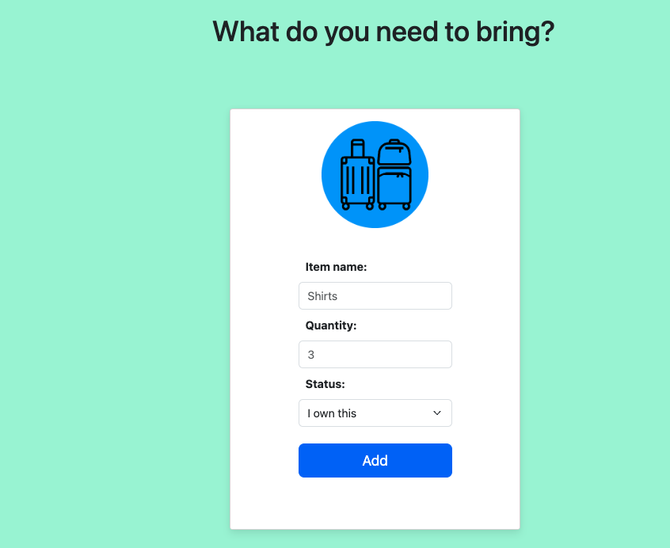

# Festival Ace
# Developed by:
-Nicole Prati

## Summary:
-Festival Ace is a festival planning app. It houses a database with all of the festivals world wide. The app is designed to allow a user to:
-View All festivals on the Festivals index page
_Log in and:
-View Individual festival deatail page and add it to their own My Festival Page
-Create/Edit/update tasks related to the festival they are planning to go to
-Create/Edit/update suitcase/packing items  related to the festival they are planning to go to
-Delete festival planning pages if they are no longer planning on attenting

- ## Screenshot(s):

## Home Page

## All Festivals Page

## My Festivals Page

## Festival Details

## Add Task

## Add Packing/suitcase Item

## Technologies Used**:
- HTML
- CSS
- Bootstrap
- Python
- Django
- JavaScript
- Heroku

## Getting Started:

 ## Deployed app
https://festival-ace.herokuapp.com/

## Planning Details:
https://trello.com/b/KB7yesrI/festival-planning-app

## Pitch Deck
https://app.pitch.com/app/presentation/8a0d9f95-88e3-45b6-afdb-30ddf9079324/aa8df5ac-0762-4d02-b750-066bbf36d87e

## Future Enhancements :

## Admin
-Create admin functionality that allows a user with an admin role to create/update/delete festivals in the festivals database on the front end

## User
- Allow the user to organize packing list by category of items--ie if camping they would have a sub section within their list for camping needs
- Allow users to add memebers to thier planning documents so everyone that is attending the festival can be on the same planning page
- Allow user to check a task is done and have it update on the page instead of going to a form
- Include some sort of budget functionality where the user can keep track of estimatesd cost vs actual cost
- When viewing the festival detail page-- they page would have links to purchase tickets, include information about the genre of festival, map view of the location of  the festival and the lineup poster for the festival
- Include a data object in the tasks list to link information to the task--like if the task was to purchase tickets user could include a link to thier ticket information when marking the task as complete
- Enhance CSS across the application

## Attributions:

https://docs.djangoproject.com/en/4.2/
https://getbootstrap.com/docs/5.3/getting-started/introduction/
https://mdbootstrap.com/
<a href="https://www.flaticon.com/free-icons/travel" title="travel icons">Travel icons created by Eucalyp - Flaticon</a>
<a href="https://www.flaticon.com/free-icons/to-do-list" title="to do list icons">To do list icons created by kerismaker - Flaticon</a>
<a href="https://www.flaticon.com/free-icons/login" title="login icons">Login icons created by Mehwish - Flaticon</a>
<a href="https://www.flaticon.com/free-icons/ace-of-spades" title="ace of spades icons">Ace of spades icons created by Icongeek26 - Flaticon</a>
